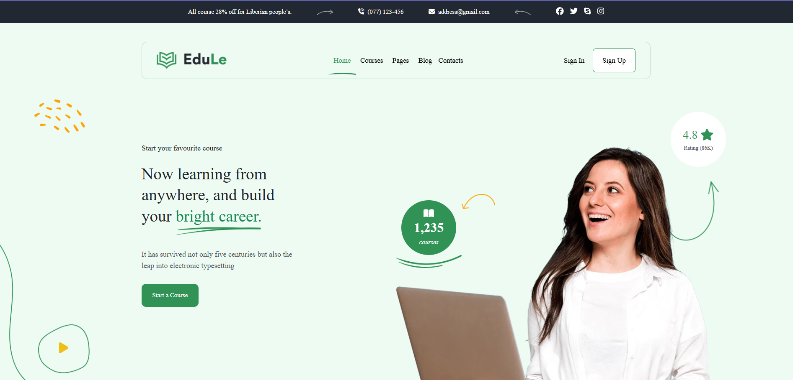

# Project Name  

**Edule** , a responsive Educational website landinng page **HTML, Sass, and Bootstrap**.  

## Features  
- fully responsive design 
- Sass-powered styling  
- component based design  
- dark mode switch   
- Well optimised with google insight techniques

## Demo  
👉 [Live Preview](https://khalid-raza03.github.io/edule-landing-page/)  

## Screenshots


## Technologies  
- HTML5  
- Sass (SCSS)  
- Bootstrap 5  
- swiper js
- Vanilla JavaScript  

## Installation in local 

1. __Clone the repo:__  

   ```bash
   git clone https://github.com/khalid-raza03/edule-landing-page.git
   ```
2. Open `index.html` in a browser.  